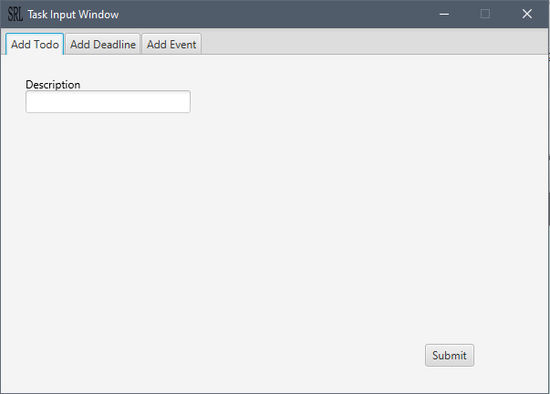
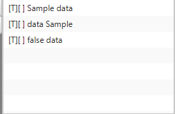
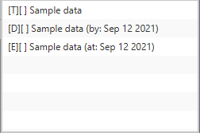

     _____            _      _ 
    /  ___|          (_)    | |
    \ `--.  __ _ _ __ _  ___| |
     `--. \/ _` | '__| |/ _ \ |
    /\__/ / (_| | |  | |  __/ |
    \____/ \__,_|_|  |_|\___|_|
    

# User Guide

## Content list
 * [Quick Start](#quick-start)
 * [Ui](#the-ui)
 * [Features](#features)
 * [Usage](#usage)
 * [Resources used](#resources-used)

## Quick Start

 1. Ensure that you have java `11` or above installed on your computer
 1. Download the latest sariel.jar from [here](https://github.com/Gabau/ip/releases)
 1. Copy the file to the folder you want to use for the _home_ _folder_
 1. Double-click the file to start the app. The GUI similar to [this](#the-ui) should appear in  
    a few seconds.
 1. Refer to the [features](#features) for more details on what can be done. 

## The UI


## Features 

### Adding tasks

Able to add tasks to program.  
Addition can be done through the command input field.
Tasks that can be added:

 1. [Todo](#todo---add-a-todo-task)
 1. [Deadlines](#deadline---add-a-deadline-task)
 1. [Events](#event---add-a-event-task)


#### Events

`event` - Keyword to add an event to do.

    event {taskname} /at {YYYY-MM-DD}

#### Adding through gui

The tasks can be added through the task input window that will  
appear after clicking on the add task button.




### [Search](#find---search-for-a-particular-task-by-description)

Ability to lookup tasks.
Tasks can be lookup by part of their name through the command  
`find` or the search field.  

The results of entry into the search field will be displayed on the  
listview section above the remove task button.


### [List](#list---display-the-tasks-added)

Displays an overview of all the tasks that have been added to  
Sariel. By default, it is already displayed in the list view  
above the remove task button.

### [Removing Tasks](#delete---delete-the-tasks)

Removal can be done via the command field or through the remove  
tasks button. To remove a task using the remove task  
button, the user has to select the task(s) to remove and  
click on the remove task button.

### [Marking Tasks]

Tasks can be marked as done through the `done` command or  
through the list view, selecting the task to be done and marking  
it as done.

## Usage

### `todo` - Add a todo task

Describe the action and its outcome.

Example of usage: 

    todo Sample description

Outcome expected:

A todo task has been added.

```
Roger! I have added this task.
[T][] Sample description
Now you have 4 tasks in the list
```

### `deadline` - Add a deadline task

Adds a deadline task. Input date must be of format  
YYYY-MM-DD

Example of usage:

```markdown
deadline description /by 2020-05-20
```


### `event` - Add a event task

Adds an event task. Input date must be of format  
YYYY-MM-DD

Example of usage:

```markdown
event description /at 2020-05-20
```


### `list` - Display the tasks added

Displays all the tasks added. If no tasks has been added,  
nothing will be displayed.

Example of usage:

```markdown
list
```


### `find` - Search for a particular task by description

Displays all the tasks that have a description that contains  
the input pattern.

Example of usage:

with the state of tasks:



Input:
```markdown
find sample
```

Sample output:

```markdown
1[T][]Sample data
2[T][]data Sample
```

### `delete` - Delete the tasks

Removes the task with the input index.

Example of usage:

with the state of tasks:



Input:
```markdown
delete 2
```

Sample output:

```markdown
The following task has been removed
[D][] Sample data (by: Sep 12 2021)
Now you have 2 tasks remaining
```

### `done` - Mark the task as done

Input, `done` {index of task to mark}, one indexed. 

```markdown
done 1
```

Marks the first task as done.

## Resources used

[unsplash](https://unsplash.com)
 
 1. [Duke image](https://unsplash.com/photos/E1e6Ucv9ONk)
 1. [User image](https://unsplash.com/photos/-oVaYMgBMbs)