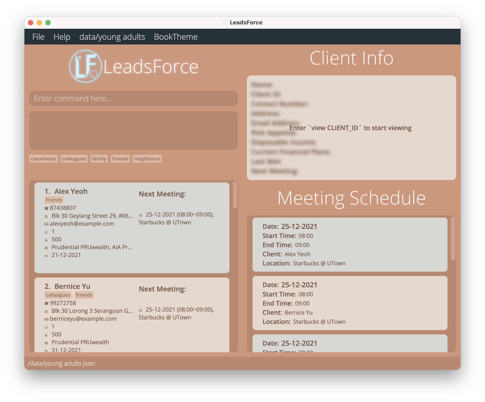

LeadsForce is a desktop app that is optimized for use via a Command Line Interface (CLI) while still having the benefits of a Graphical User Interface (GUI).
Catered towards student financial advisors, LeadsForce makes the process of managing client information seamless!
LeadsForce does this by helping the financial advisors store and retrieve client information effortlessly and seamlessly.

Finding your next lead has never been easier.
## Table of Contents

* [Quick Start](#quick-start)
* [Client Information](#client-information)
* [Features](#features)
    * [Create new contact: add](#create-new-contact--add)
    * [Retrieve particular contact: view](#retrieve-particular-contact--view)
    * [Update existing contact: edit](#update-existing-contact--edit)
    * [Delete particular contact: delete](#delete-particular-contact--delete)
    * [List all contacts: list](#list-all-contacts--list)
    * [Sort Contacts: sort](#sort-contacts--sort)
    * [Find meeting schedule: schedule](#find-meeting-schedule--schedule)
    * [Locating clients by keywords: search](#locating-clients-by-keywords--search)
    * [Filter current list: filter](#filter-current-list-by-keywords--filter)
    * [Clearing all entries: clear](#clearing-all-entries--clear)
    * [Exiting the program: exit](#exiting-the-program--exit)
    * [Create new address book: ab create](#create-new-address-book--ab-create)
    * [Delete existing address book: ab delete](#delete-existing-address-book-ab-delete--ab-delete)
    * [Switch to different address book: ab switch](#switch-to-different-address-book--ab-switch)
    * [List all address book: ab list](#list-all-address-book--ab-list)
    * [Saving data](#saving-the-data)
    * [Edit data file](#edit-data-file)
* [FAQ](#faq)
* [Command Summary](#command-summary)

--------------------------------------------------------------------------------------------------------------------

## Quick start

1. Ensure you have Java `11` or above installed in your computer.

2. Download the latest `leadsforce.jar` from [here](https://github.com/AY2122S1-CS2103T-T17-3/tp/releases).

3. Copy the file to the folder you want to use as the _home folder_ for your LeadsForce.

4. Double-click the file to start the app. The GUI similar to the below should appear in a few seconds. Note how the app contains some sample data. 
   

5. Type the command in the command box and press Enter to execute it. e.g. typing **`help`** and pressing Enter will open the help window. 
   Some example commands you can try:

    * **`list`** : Lists all contacts.

    * **`add`**`n/John Doe p/98765432 e/johnd@example.com a/John street, block 123, #01-01` : Creates a contact named `John Doe` to the Address Book.

    * **`delete`**`3` : Deletes the 3rd contact shown in the current list.

    * **`clear`** : Deletes all contacts.

    * **`exit`** : Exits the app.

6. Refer to the [Features](#features) below for details of each command.

--------------------------------------------------------------------------------------------------------------------

## Client Information

Every client that is registered in LeadsForce have the following attributes that has the corresponding attribute type and argument tag.

Client Attribute | Type of Attribute | Argument Tag
-----------------|-----------------|-----------------
Client ID (**Unique**) | Integer (assigned on creation of new contact) | i/
Name (**Compulsory**) | String | n/
Email (**Compulsory**)| String (email address)| e/
Address | String | a/
Current financial plans | List of Strings | c/
Disposable Income | Integer | d/
Last met | Date | l/
Next Meeting | Composite (More information below table) | m/
Contact number | Integer (8 digits long)| p/
Risk appetite | Integer from 1-5,  where 1 is very low risk tolerance and 5 is very high risk tolerance| r/
Tag | String | t/

### NextMeeting
NextMeeting entails the next meeting's *date*, *startTime*, *endTime* and *location*.
A NextMeeting needs to be inputted in the following form:

`m/dd-MM-yyyy (hh:mm~hh:mm), {non-empty location string)`

where
* *date* is in the format `dd-MM-yyyy`
* *startTime* and *endTime* are in `hh:mm` (24 hour format)
* *location* is a non-empty string

For example, a valid NextMeeting is:

`m/25-12-2021 (00:00~23:59), Santa's Workshop`

Furthermore, when the NextMeeting is over, the NextMeeting will automatically be set to null.
This happens whenever the changes are made to the client list or when the address book is opened/loaded.

### LastMet
Similar to NextMeeting, the LastMet is automatically updated from a NextMeeting that is over.

--------------------------------------------------------------------------------------------------------------------

## Features

**:information_source: Notes about the command format:** 

* When `<attribute>` is given, it means that the any *attribute tag* can be used, with the exception of *client id* in some cases
* In the format for the commands provided, words which are in `UPPERCASE` refers to the `input` that the user must key in
* If the inputs are wrapped in curly brackets `{}`, they are inputs that are related to the preceeding argument tag

* Inputs in square brackets are optional input: 
  e.g. `KEYWORD [OTHER_KEYWORD]` can be in the form of `firstName` or `firstName lastName`

* Inputs with `…`​ at the end refers to commands that can accept multiple attribute inputs
   
  e.g. `<email>/{EMAIL}…​` can be in the form of `e/@gmail.com` or `e/@gmail.com r/5`

### Create New Contact : `add`

Adds a new client to the address book.

Format: `add n/{CLIENT'S NAME} e/{EMAIL} <attribute>/{OTHER ATTRIBUTES} ...​`

* A client must have minimally the name and email tag filled during creation
* Any other tags are optional
* Tags that can be added are as seen in the client information in the Client Info Section

Examples:
* `add n/Benedict Chua e/benchua@hotmail.com`
* `add n/Keith e/keithtan@ymail.com p/12345678 r/4`

### Retrieve Particular Contact : `view`

Fully view a client’s information in detail.

Format: `view {CLIENT'S ID}`

Example: `view 2` would be used to view client 2's information

### Update Existing Contact : `edit`

Update the information of existing users by using the “edit” command. This can be used to update the
attributes of a client, using the tag of the client’s attribute.

* Multiple attributes could be changed with one command.
* Multiple clients can be edited at the same time with the provided attributes by indicating their ids separated by a space.

Format:
`edit {CLIENT'S ID}... <attribute>/{CHANGED VALUE OF ATTRIBUTE}...`

Examples:

* `edit 15 n/Dominic` command changes the name of client 15 to “Dominic”.
* `edit 3 p/12345678 r/5` command changes the contact number to “12345678” and the risk appetite to 5 for the client who’s client id is 3.
* `edit 15 13 r/3` command changes the risk appetite of client 13 & 15 to “3”.

### Delete particular contact : `delete`

Deletes an existing client from the address book using their client id.

Format: `delete {CLIENT'S ID}...`

* Multiple clients can be deleted at the same time by their ids separated by a space.

Examples:
* `delete 7` will deletes client with client id 7
* `delete 4 8 6` will deletes the clients whose client id is 4, 6 and 8

### List all contacts : `list`

Shows the full list of all clients in the address book.

Format: `list`

### Sort Contacts : `sort`

Sorts clients in order based off the inputted attribute

Format: `sort <attribute>/{ASC/DSC}...`

* The asc and dsc tag dictates whether filtered client list is sorted in ascending or descending order.
* If multiple attributes are provided, then the clients will be sorted by the attributes sequentially.
e.g. `sort d/asc m/dsc`, this will sort the clients by disposable income first, then for those clients whose
disposable income are the same, they will be sorted by next meeting in descending.
* Sorting by the attribute Tag (t/) is not supported.
* The tags are case-insensitive. (ASC and asc are both okay.)

Examples:
* `sort r/ASC` will sort the list by ascending risk-appetite
* `sort i/dsc` will sort the list by descending client id

### Find meeting schedule : `schedule`

Finds the meeting schedule that the user has on a specified date.

Format: `schedule {DATE}`

* `DATE` has to be in the format of dd-MM-yyyy, where Day(dd), Month(MM) and Years(yyyy) are numerical values.
* if the `{date}` is not specified, all meetings will be displayed.

Example:
* `schedule 22-09-2021` allows the user to view the schedule that the user has on the 22nd September 2021.
* `schedule` displays all meetings

### Locating clients by keywords : `search`

Finds clients whose contacts match with the given keywords.

Format: `search {KEYWORD}... <attribute>/{ATTRIBUTE_KEYWORD}...`

* `KEYWORD` will be used to match with all attribute of the client.
* `<attribute>/` refers to the argument tag for the client's attribute.
* `{ATTRIBUTE_KEYWORD}` refers to the keyword that is to be matched with the corresponding client attribute.
* If no `KEYWORD` is provided, search will be based on `<attribute>/{ATTRIBUTE_KEYWORD}` only.
* The search is case-insensitive. e.g `keith` will match `Keith`.
* The order of the keywords does not matter. e.g. `John Doe` will match `Doe John`.
* Clients matching at least one keyword will be returned).
  e.g. `Hans Bo` will return `Hans Gruber`, `Bo Yang`.
* If attribute keyword is provided, only clients whose attribute matches with the attribute keyword will be returned.
  e.g. `Tom Tim e/@gmail.com` will return `Tom Lee e/Tom@gmail.com` and not `Tim Shum e/Tim@yahoo.com`.

Examples:
* `search John` returns `john` and `John Doe`
* `search alex david` returns `Alex Yeoh`, `David Li` 

### Filter current list by keywords : `filter`

Filter the current list by the given keywords.

Format: `filter {KEYWORD}... <attribute>/{ATTRIBUTE_KEYWORD}...`

* Works similar to `search` but `filter` works based on the current list shown as opposed to entire lists of contacts.
* `KEYWORD` will be used to match with all attribute of the client.
* If no `KEYWORD` is provided, then filter will be based on `<attribute>/{ATTRIBUTE_KEYWORD}`
* `<attribute>/` refers to the argument tag for the client's attribute.
* `{ATTRIBUTE_KEYWORD}` refers to the keyword that is to be matched with the corresponding client attribute.
* The filter is case-insensitive. e.g `keith` will match `Keith`.
* The order of the keywords does not matter. e.g. `John Doe` will match `Doe John`.
* Clients matching at least one keyword will be returned).
  e.g. `Hans Bo` will return `Hans Gruber`, `Bo Yang`.
* If attribute keyword is provided, only clients whose attribute matches with the attribute keyword will be returned.
  e.g. `Tom Tim e/@gmail.com` will return `Tom Lee e/Tom@gmail.com` and not `Tim Shum e/Tim@yahoo.com`.

Examples:
* `search John` returns `john` and `John Doe`
* `search alex david` returns `Alex Yeoh`, `David Li` 

### Clearing all entries : `clear`

Clears all entries from the address book.

Format: `clear`

* After inputting `clear`, another prompt will appear requesting for confirmation to clear the address book.
* The input required for the confirmation will either be:
  * `yes`: to confirm and proceed with the clear command.
  * `no`: to cancel the clear command.

### Exiting the program : `exit`

Exits the program.

Format: `exit`

### Create new address book : `ab create`

Create a new address book by the name provided and switch to it.

Format: `ab create {ADDRESSBOOK_NAME}`

* `{ADDRESSBOOK_NAME}` refers to the name to be given to the new address book.
* The name of the addressbook cannot be the same as an existing address book.

Examples:
* 'ab create vip clients' will create a new address book named `vip clients`

### Delete existing address book: ab delete : `ab delete`

Delete an address book that currently exists.

Format: `ab delete {ADDRESSBOOK_NAME}`

* `{ADDRESSBOOK_NAME}` refers to the name of the address book to be deleted .
* The current address book cannot be deleted, switch to another address book first before deleting the address book.

Examples:
* 'ab delete test' will delete the address book named `test`

### Switch to different address book : `ab switch`

Switch to a different address book that currently exists.

Format: `ab switch {ADDRESSBOOK_NAME}`

* `{ADDRESSBOOK_NAME}` refers to the name of the address book to switched to .

Examples:
* 'ab switch other' will switch over to the address book named `other`

### List all address book : `ab list`

List all the name of all the existing address books

Format: `ab list`

### Saving the data

LeadsForce's data are saved in the hard disk automatically after any command that changes the data. There is no need to save manually.

### Edit data file

LeadsForce's data are saved as a JSON file `[JAR file location]/data/addressbook.json`. Advanced users are welcome to update data directly by editing that data file.

:exclamation: **Caution:**
If your changes to the data file makes its format invalid, AddressBook will discard all data and start with an empty data file at the next run.

--------------------------------------------------------------------------------------------------------------------

## FAQ

**Q**: How do I transfer my data to another computer? 
**A**: Install the app in the other computer and overwrite the empty data file it creates with the file that contains the data of your previous LeadsForce home folder.

--------------------------------------------------------------------------------------------------------------------

## Command summary

Action | Format | Examples
--------|---------|---------
**Create** | `add <name>/{CLIENT'S NAME} <email>/{EMAIL} <phone-no>/{PHONE NUMBER} <risk-appetite>/{RISK-APPETITE} ...`| add n/benedict e/benedict@gmail.com p/90909898 r/3 |
**View** | `view {CLIENT'S ID}` | view 123 |
**Edit** | `edit {CLIENT'S ID}... <attribute>/{CHANGED VALUE OF ATTRIBUTE}...` | edit 1234 n/Dominic p/12345678 |
**Delete** | `delete {CLIENT'S ID}...` | delete 4  |
**List** | `list` | - |
**Sort** | `sort <attribute>/{ASC/DESC}...` | sort r/asc |
**Schedule** | `schedule {DATE}` | schedule 22-09-2021 |
**Search** | `search {KEYWORD}... <attribute>/{ATTRIBUTE_KEYWORD}...` | search * e/doe@gmail.com r/5 |
**Filter** | `filter {KEYWORD}... <attribute>/{ATTRIBUTE_KEYWORD}...` | filter * e/doe@gmail.com p/9 |
**Clear** | `clear` | - |
**Exit** | `exit` | - |
**Create Address Book** | `ab create {ADDRESSBOOK_NAME}` | ab create vip
**Delete Address Book** | `ab delete {ADDRESSBOOK_NAME}` | ab delete book
**Switch Address Book** | `ab switch {ADDRESSBOOK_NAME}` | ab switch another
**List Address Book** | `ab list` | -

